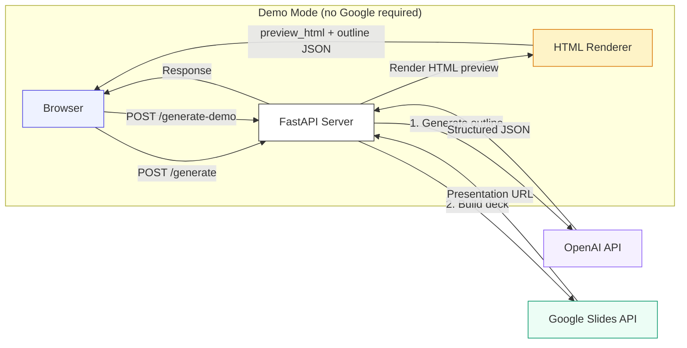

# Slides Agent

AI-powered presentation generator that turns a topic into a polished Google Slides deck in seconds. Powered by GPT-4o for intelligent content generation and the Google Slides API for automated deck building.


User: remove slides until only 5 slides

Agent: Removed 4 slide(s) from the end. Now at 5 slides.

User: delete the slide deck

Agent: Ready to delete this presentation. Please confirm.

User: Confirm 

Agent: Action confirmed and applied.

## Features

- **AI-generated outlines** — GPT-4o creates narrative-driven slide decks with compelling titles, supporting bullets, and full speaker notes
- **Automated Google Slides** — Outlines are built into real, styled Google Slides presentations with one click
- **Demo mode** — Try the app without Google credentials; get a rendered HTML preview and downloadable JSON outline
- **Customizable** — Choose audience, tone (professional/casual/academic), and slide count (5–20)
- **Polished frontend** — Clean single-page UI with live loading states and embedded slide previews

## Tech Stack

| Layer | Technology |
|-------|-----------|
| AI | [GPT-4o](https://platform.openai.com/docs/models/gpt-4o) via [OpenAI Python SDK](https://github.com/openai/openai-python) |
| Backend | [FastAPI](https://fastapi.tiangolo.com/) + [Uvicorn](https://www.uvicorn.org/) |
| Slides API | [Google Slides API v1](https://developers.google.com/slides/api) via `google-api-python-client` |
| Auth | Google OAuth 2.0 (Desktop app flow) |
| Frontend | Vanilla HTML/CSS/JS (single-page, no build step) |

## Architecture



**Request flow:**

1. User fills out topic, audience, tone, and slide count in the frontend
2. Frontend sends a POST request to `/generate` (full mode) or `/generate-demo` (demo mode)
3. Server sends the parameters to GPT-4o with a [carefully crafted system prompt](#how-it-works-prompting-strategy) that enforces narrative structure
4. GPT-4o returns a structured JSON outline with titles, bullets, and speaker notes
5. **Full mode:** The outline is translated into Google Slides API batch requests — creating slides, text boxes, styling, accent lines, and speaker notes in two passes
6. **Demo mode:** The outline is rendered into a self-contained HTML slide deck preview
7. The frontend displays the result with an embedded preview and action buttons

## Evaluation

**Eval set:** 10 test cases across 7 categories (count, content_edit,
structural, addition, deletion, destructive, rename) using a shared 8-slide
outline about remote work productivity. Each case checks correct tool
selection; cases with argument constraints also validate the tool args.

**Configurations:**
- **Config A — Baseline:** GPT-4o with a minimal system prompt
  (`"You are a presentation editor. Pick the right tool."`)
- **Config B — Engineered prompt:** GPT-4o with the full production
  REVISE_SYSTEM_PROMPT including per-tool selection rules and slide-count guidance

| Category     | Config A pass@1 | Config A pass@3 | Config B pass@1 | Config B pass@3 |
|--------------|:-:|:-:|:-:|:-:|
| count        | 1.00 | 1.00 | 0.75 | 1.00 |
| content_edit | 0.89 | 1.00 | 0.33 | 0.83 |
| structural   | 1.00 | 1.00 | 0.33 | 1.00 |
| addition     | 1.00 | 1.00 | 1.00 | n<3 |
| deletion     | 0.60 | 1.00 | 0.00 | n<3 |
| destructive  | 0.60 | 1.00 | 0.00 | n<3 |
| rename       | 1.00 | 1.00 | 0.00 | n<3 |
| **overall**  | 0.92 | 1.00 | 0.45 | 0.95 |

### Running the evals

```bash
pip install inspect-ai
./evals/run_evals.sh
```

The script runs each config three times against `openai/gpt-4o-mini`, then prints a markdown pass@k table via [`evals/compute_passk.py`](evals/compute_passk.py). Eval logs are written to `evals/logs/`.

## Local Setup

### Prerequisites

- Python 3.10+
- An [OpenAI API key](https://platform.openai.com/api-keys)
- (Optional) Google Cloud project with Slides API enabled — only needed for full mode

### 1. Clone and install

```bash
git clone https://github.com/your-username/slides-agent.git
cd slides-agent
python -m venv venv
source venv/bin/activate  # Windows: venv\Scripts\activate
pip install -r requirements.txt
```

### 2. Configure environment

```bash
cp .env.example .env
```

Edit `.env` and add your OpenAI API key:

```
OPENAI_API_KEY=sk-...
```

That's enough to run **demo mode**. For full Google Slides integration, see [Google API Setup](#google-api-setup) below.

### 3. Run the server

```bash
python main.py
```

Open [http://localhost:8000](http://localhost:8000) in your browser.

## Google API Setup

> Skip this section if you only want to use demo mode.

### 1. Create a Google Cloud project

1. Go to the [Google Cloud Console](https://console.cloud.google.com/)
2. Create a new project (or select an existing one)
3. Navigate to **APIs & Services > Library**
4. Search for **Google Slides API** and click **Enable**

### 2. Configure the OAuth consent screen

1. Go to **APIs & Services > OAuth consent screen**
2. Select **External** user type and click **Create**
3. Fill in the required fields (app name, user support email, developer email)
4. On the **Scopes** page, add `https://www.googleapis.com/auth/presentations`
5. On the **Test users** page, add your Google email address
6. Click **Save and Continue** through the remaining steps

### 3. Create OAuth credentials

1. Go to **APIs & Services > Credentials**
2. Click **+ Create Credentials > OAuth client ID**
3. Select **Desktop app** as the application type
4. Name it (e.g., "Slides Agent") and click **Create**
5. Click **Download JSON** and save the file as `credentials.json` in the project root

### 4. Authorize on first run

The first time you use full mode, a browser window will open asking you to sign in with your Google account and grant the app access to create presentations. After authorizing, a `token.json` file is saved locally so you won't need to re-authorize.

```
GOOGLE_CREDENTIALS_FILE=credentials.json  # already in .env.example
```

## API Endpoints

### `POST /generate`

Creates a real Google Slides presentation. Requires Google OAuth credentials.

**Request:**
```json
{
  "topic": "Why Remote Teams Outperform In-Office Teams",
  "audience": "executives",
  "num_slides": 7,
  "tone": "professional"
}
```

**Response:**
```json
{
  "url": "https://docs.google.com/presentation/d/1abc.../edit",
  "presentation_id": "1abc...",
  "outline": { "title": "...", "slides": [...] }
}
```

### `POST /generate-demo`

Generates an outline and HTML preview without Google credentials. Only requires an OpenAI API key.

**Request:** Same as `/generate`.

**Response:**
```json
{
  "outline": { "title": "...", "slides": [...] },
  "preview_html": "<!DOCTYPE html>..."
}
```

### `GET /health`

Returns API status and credential availability.

## Example Input & Output

**Input:**
| Field | Value |
|-------|-------|
| Topic | Why Remote Teams Outperform In-Office Teams |
| Audience | Executives |
| Slides | 7 |
| Tone | Professional |

**Output outline** (see full file at [`example_output/sample_outline.json`](example_output/sample_outline.json)):

```json
{
  "title": "Why Remote Teams Outperform In-Office Teams",
  "slides": [
    {
      "title": "The $600B question: Is your office actually helping?",
      "bullets": [
        "U.S. companies spend $600B+ annually on office real estate",
        "Yet Stanford research shows remote workers are 13% more productive",
        "The gap between perception and data is costing organizations dearly"
      ],
      "speaker_notes": "Open with the tension between what companies spend and what the data actually shows..."
    }
  ]
}
```

Each slide includes:
- **Title** — A clear assertion or question, never a vague label
- **Bullets** — Supporting evidence and data points
- **Speaker notes** — Full talking track with delivery cues

## How It Works: Prompting Strategy

The quality of the generated decks comes from a carefully engineered system prompt in [`openai_agent.py`](openai_agent.py). Here's the strategy:

### Role framing

The model is cast as _"an expert presentation designer who has coached TED speakers and built decks for Fortune 500 keynotes."_ This anchors it in high-quality presentation design rather than generic text generation.

### Structural constraints

The prompt enforces specific rules that prevent common AI pitfalls:

| Rule | Why it matters |
|------|---------------|
| _"Open with a hook"_ | Prevents the typical "Introduction" or "Agenda" first slide |
| _"Build a narrative arc"_ | Ensures slides tell a story with tension and resolution, not just list subtopics |
| _"Each slide makes ONE point"_ | Stops the model from cramming multiple ideas into a single slide |
| _"Title should be a complete assertion, not a vague label"_ | Forces titles like _"Teams using X ship 40% faster"_ instead of _"Benefits"_ |
| _"Bullets are supporting evidence, not restatements"_ | Prevents redundancy between title and content |
| _"Speaker notes contain the talking track"_ | Generates actually useful notes with delivery guidance |

### Tone calibration

The prompt maps each tone setting to a distinct style:
- **Professional** — polished, data-forward, concise
- **Casual** — conversational, story-driven, approachable
- **Academic** — precise, citation-aware, methodical

### Output format

The prompt requests **raw JSON only** (no markdown fences, no commentary). The code also strips markdown code fences as a fallback, ensuring reliable parsing.

### Slide Building

The PowerPoint builder creates a `.pptx` file from the generated outline, applying layout-specific text boxes, styling, accent shapes, and speaker notes.

## Project Structure

```
lambdas/slides/
├── __init__.py
├── openai_agent.py                  # OpenAI integration, system prompt, outline generation
├── openai_agent_rewriter.py         # Additional AI rewriting utilities
├── slides_builder.py                # PowerPoint deck building
├── tool_executor.py                 # Tool execution engine
├── tools_registry.py                # Tool definitions for the AI model
├── session_store.py                 # In-memory session management
├── pending_actions.py               # Confirmation-required action tracking
├── Dockerfile
├── requirements.txt
├── README.md
├── .env.example
└── .gitignore
```

## License

MIT
